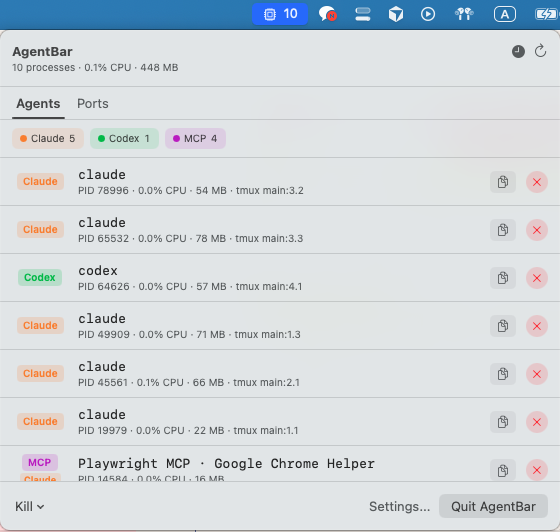

# AgentBar

A lightweight macOS menu bar app that monitors and cleans up AI assistant processes — **Claude**, **Codex**, **Gemini**, and **MCP servers**.

Stop letting forgotten `claude`, `codex`, `gemini-cli`, and `node` MCP-server processes pile up after a long day of AI-assisted coding. AgentBar shows what's running, how much CPU/memory each agent is eating, and lets you terminate them with one click.

> Built with SwiftUI's `MenuBarExtra` (macOS 13+). No dock icon, ~300 KB binary, polls `ps` every 3 seconds.



## Features

### Process Monitoring
- **Live menu bar count** of running AI agent processes
- **Per-agent grouping** — separate counts for Claude / Codex / Gemini / MCP
- **Per-process detail** — PID, CPU%, memory usage, terminal location
- **Zombie detection** — flags `Z`-state processes with a red badge
- **Kill button** — SIGTERM per process, with graceful fallback to SIGKILL if still alive after 3 seconds
- **Bulk kill** — kill all processes at once, or all of one agent type
- **Copy process info** — one-click copy of agent/PID/CPU/command for pasting into an AI assistant

### Terminal Integration
- **Click to focus** — tap a process row to jump to its terminal window or tmux pane
- **tmux support** — detects session/window/pane, flashes the pane on focus, groups processes by tmux window in the UI
- **MCP parent detection** — MCP server rows show which agent owns them and focus that agent's terminal on click

### Ports Tab
- **Listening ports** — shows all processes with open TCP/UDP ports (via `lsof`)
- **Agent badge** — highlights ports held by recognized AI agents
- **Hide system ports** — filters out known macOS daemons (sshd, mDNSResponder, sharingd, etc.)
- **Kill by port** — terminate the process holding a given port; system process kills require confirmation

### Settings & Display
- **Sort order** — CPU usage, most recent PID, or tmux window/pane
- **Settings window** — native macOS settings UI with tabs (General, Ports, About)
- **No dock icon** — proper background `LSUIElement` app

## Install

### One-line install (recommended)

```bash
curl -fsSL https://raw.githubusercontent.com/CenCiviC/AgentBar/main/install.sh | bash
```

Installs to `~/Applications/AgentBar.app` and launches the app. Run the same command again to update.

### Build from source

Requires macOS 13+, Swift 5.9+ command-line tools (or Xcode 15+).

```bash
git clone https://github.com/CenCiviC/AgentBar.git
cd AgentBar
./Scripts/build-app.sh
open build/AgentBar.app
```

### Launch at login

Drag `AgentBar.app` to **System Settings → General → Login Items**.

## How it works

AgentBar runs `ps -axo pid,pcpu,rss,stat,comm,command` every 3 seconds and matches each process against pattern rules:

| Agent  | Basenames | Command substrings |
|--------|-----------|-------------------|
| Claude | `claude`, `claude-code` | `@anthropic-ai/claude-code`, `anthropic-ai/claude` |
| Codex  | `codex` | `@openai/codex`, `openai/codex` |
| Gemini | `gemini`, `gemini-cli` | `@google/gemini`, `google/gemini-cli` |
| MCP    | — | `mcp-server`, `@modelcontextprotocol`, `mcp-` |

Port scanning runs `lsof -nP -iTCP -iUDP -sTCP:LISTEN` concurrently and cross-references PIDs with the agent process list.

## Adding a new agent

1. Add a case to `AgentKind` in `Sources/AgentBar/Models/AgentKind.swift`
2. Set a `color` and `rules` (basenames + commandSubstrings)

The UI picks it up automatically.

## Development

```bash
swift build          # debug build
swift run            # run from terminal (Ctrl-C to stop)
./Scripts/lint.sh    # run SwiftLint
./Scripts/format.sh  # run SwiftFormat
```

## Release

```bash
./Scripts/release.sh patch   # 1.0.0 → 1.0.1
./Scripts/release.sh minor   # 1.0.0 → 1.1.0
./Scripts/release.sh major   # 1.0.0 → 2.0.0
```

Bumps `version.env`, commits, builds, zips, and publishes to GitHub Releases.

## Contributing

1. Fork and create a feature branch
2. Run `swift build` to confirm it compiles
3. Test by running `swift run` and verifying the menu bar UI
4. Open a PR with a short description and a screenshot for UI changes

Bug reports and feature requests are welcome — open an issue.

## Inspired by

- [codexbar.app](https://codexbar.app/) — a Codex-focused menu bar app
- macOS power-user utilities like `htop`, `Stats`, `iStat Menus`

## License

[MIT](./LICENSE)
