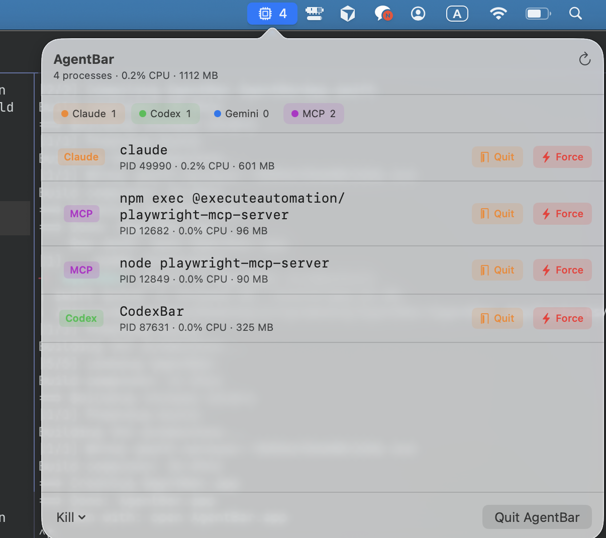

# AgentBar

A lightweight macOS menu bar app that monitors and cleans up AI assistant processes — **Claude**, **Codex**, **Gemini**, and **MCP servers**.

Stop letting forgotten `claude`, `codex`, `gemini-cli`, and `node` MCP-server processes pile up after a long day of AI-assisted coding. AgentBar shows what's running, how much CPU/memory each agent is eating, and lets you terminate them with one click.

> Built with SwiftUI's `MenuBarExtra` (macOS 13+). No dock icon, ~300 KB binary, polls `ps` every 3 seconds.



## Features

- **Live menu bar count** of running AI agent processes
- **Per-agent grouping** — separate counts for Claude / Codex / Gemini / MCP
- **Per-process detail** — PID, CPU%, memory, full command on hover
- **Zombie detection** — flags `Z`-state processes
- **Hover-to-reveal kill buttons** — SIGTERM (orange) or SIGKILL (red)
- **Bulk actions** — kill all, or kill all of one agent type
- **No dock icon** — proper background `LSUIElement` app

## Install

### Build from source

Requires macOS 13+, Xcode 15+ (or Swift 5.9+ command-line tools).

```bash
git clone https://github.com/<you>/AgentBar.git
cd AgentBar
./build-app.sh
open AgentBar.app
```

To make it launch at login, drag `AgentBar.app` to **System Settings → General → Login Items**.

### Development

```bash
swift run -c release
```

The app appears in the menu bar; `Ctrl-C` in the terminal to stop.

## How it works

AgentBar runs `ps -axo pid,pcpu,rss,stat,comm,command` every 3 seconds and matches each process's command line against a small set of patterns:

| Agent  | Match patterns |
|--------|----------------|
| Claude | `claude`, `anthropic` |
| Codex  | `codex`, `openai/codex`, `@openai/codex` |
| Gemini | `gemini-cli`, `@google/gemini`, `google/gemini-cli` |
| MCP    | `mcp-server`, `@modelcontextprotocol`, `mcp-` |

Edit `Sources/AgentBar/ProcessMonitor.swift` to add new agents or tune patterns — each kind is one case in the `AgentKind` enum.

## Adding a new agent

1. Add a case to `AgentKind` in `ProcessMonitor.swift`
2. Pick a `color` for it
3. Add match `patterns`
4. Add it to `detectableKinds`

That's it — the UI picks it up automatically.

## Roadmap

- [ ] Settings window (toggle agents, configure patterns, polling interval)
- [ ] Parse Claude Code session logs (`~/.claude/projects/*/*.jsonl`) to show token use and current model
- [ ] "Reveal logs in Finder" / "Open in Terminal" per row
- [ ] Launch at login via `SMAppService` (no manual Login Items step)
- [ ] Notifications when an agent crashes or exceeds a token threshold
- [ ] Universal binary + signed/notarized release for direct download
- [ ] Homebrew cask

PRs welcome — see **Contributing** below.

## Contributing

This is a small project; structure is intentionally minimal:

```
Sources/AgentBar/
├── AgentBarApp.swift     # @main + MenuBarExtra scene
├── ProcessMonitor.swift  # ps polling, agent kind matching, kill helpers
└── ContentView.swift     # popover UI
```

To contribute:

1. Fork and create a feature branch
2. Run `swift build` to make sure it still compiles
3. Test manually by running `swift run -c release` and verifying the menu bar UI behaves as expected
4. Open a PR with a short description of the change and a screenshot if it's a UI change

Bug reports and feature requests are very welcome — open an issue.

## Inspired by

- [codexbar.app](https://codexbar.app/) — a Codex-focused menu bar app
- macOS power-user utilities like `htop`, `Stats`, `iStat Menus`

## License

[MIT](./LICENSE)
